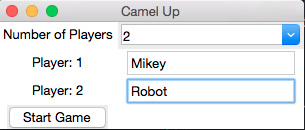
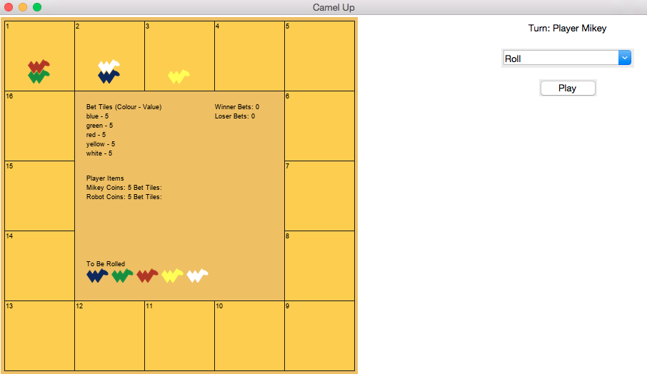

camelup
===============================
.. image:: https://img.shields.io/badge/python-3.7-green.svg
  :target: https://www.python.org/downloads/release/python-370/
.. image:: https://img.shields.io/badge/code%20style_black-000000.svg
  :target: https://github.com/amvb/black

Camelup is a boardgame where you bet on camels racing around a board, published by `Pegasus Spiele`. The driving idea behind this package was to build a computer player for this game that would play optimally. Using a `multi agent system <https://cs.uwaterloo.ca/~klarson/teaching/F17-486/notes/15GT.pdf>` the computer recursively searches for the play that will maximize their utility within the game. While building a game playing robot is fun, its more fun when you expose that robot. This package contains a lo-fi `tkinter` app that exposes the gameplay to users and allows for play against the robot. For more information on that gameplay and information about the multi agent implementation, sphinx documentation can be found `here <https://michael-gracie.github.io/camelup/>`_.

Quick Installation
------------------

.. code-block:: bash

  pip install git+https://github.com/michael-gracie/camelup.git

Gameplay
------------------

After installation, to start playing camelup run the command

.. code-block:: bash

  python -m camelup.app

This will start a `tkinter` app and you will be brought to the start game screen.

By inputing robot in the player name boxes it will initiate a robot player. If you just want to play against your friends input their names. From there this will bring you to the game screen.

On the right of the screen you will select your move until the game is finished at which point you will be prompted to whether you wish to play again.

Developer Instructions
----------------------

To install the package with development dependencies run the command

.. code-block:: bash

  pip install -e .[dev]

This will enable the following

- Unit testing using `pytest <https://docs.pytest.org/en/latest/>`_
  - Run ``pytest`` in root package directory
- Pre commit hooks ensuring codes style using `black <https://github.com/ambv/black>`_ and `isort <https://github.com/pre-commit/mirrors-isort>`_
- Sphinx documentation
  - To create sphinx run ``make html`` in package docs folder
  - To view locally run ``python -m http.server``
